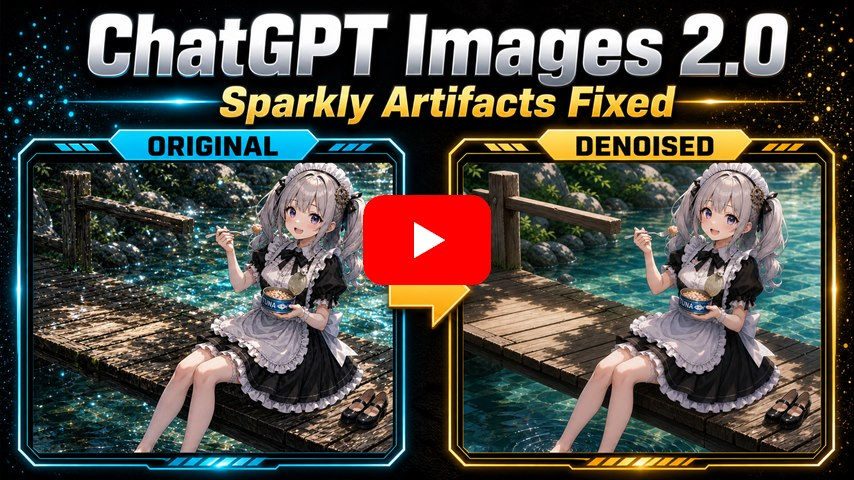
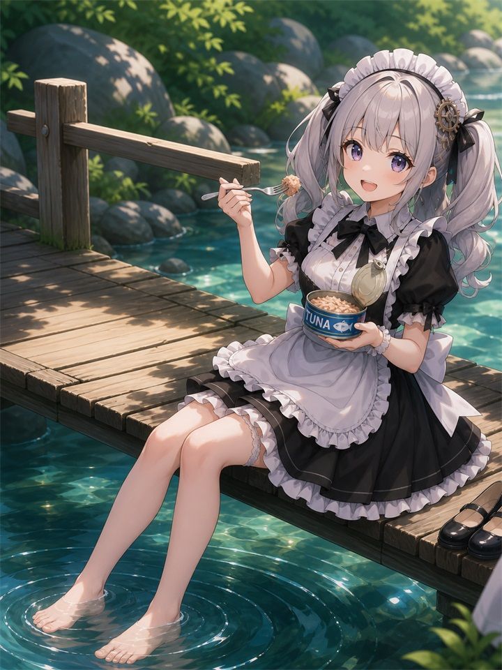
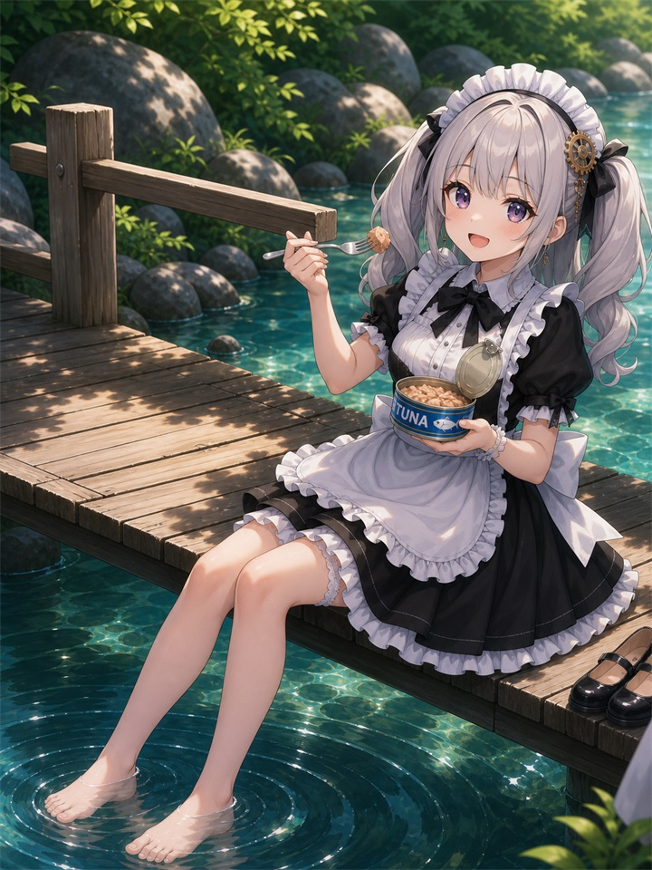
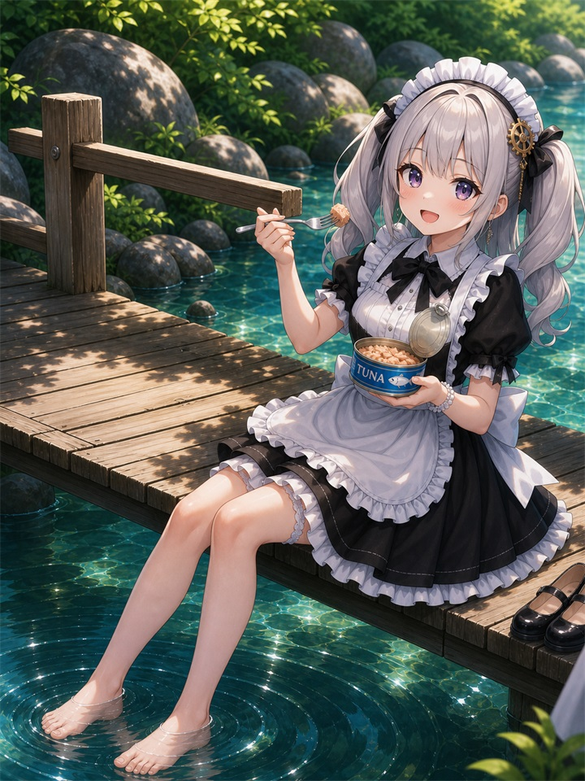
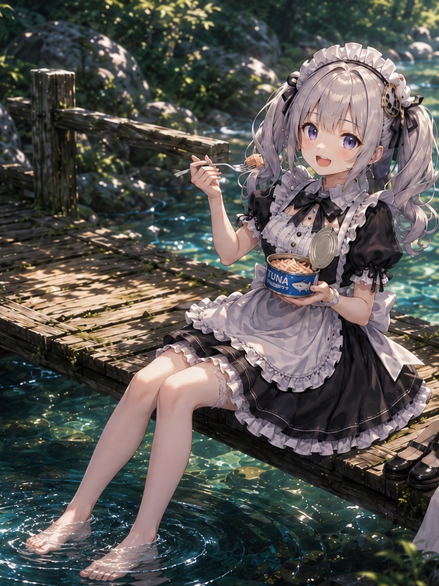

# GPT-Image2

<p align="center">
  <a href="https://youtu.be/CdE4gloKKsw">
    
  </a>
</p>

## Image Prompt and Simplify Results

<table>
  <tr>
    <td width="50%" align="center" valign="top">
      
      <br>
      <strong>Detail Level 1 - Clean Simplified</strong><br>
      Strongly reduces speckled noise and busy micro-texture while keeping the original composition readable.<br>
      점 형태의 노이즈와 복잡한 미세 질감을 강하게 줄이면서 원본 구도를 읽기 쉽게 유지합니다.<br>
      点状のノイズと複雑な微細テクスチャを大きく抑えながら、元の構図を読み取りやすく保ちます。
    </td>
    <td width="50%" align="center" valign="top">
      
      <br>
      <strong>Detail Level 2 - Balanced Detail</strong><br>
      Preserves rich illustration detail while smoothing noisy micro-contrast and scattered highlights.<br>
      풍부한 일러스트 디테일을 유지하면서 노이즈성 미세 대비와 흩어진 하이라이트를 부드럽게 정리합니다.<br>
      豊かなイラストのディテールを保ちながら、ノイズのある微細なコントラストと散ったハイライトを滑らかに整えます。
    </td>
  </tr>
  <tr>
    <td width="50%" align="center" valign="top">
      
      <br>
      <strong>Detail Level 3 - Rich Detail</strong><br>
      Keeps the detailed rendering intact and selectively removes distracting dot-like noise.<br>
      세밀한 렌더링은 그대로 유지하고 방해되는 점 형태의 노이즈만 선택적으로 제거합니다.<br>
      細密なレンダリングはそのまま保ち、邪魔になる点状ノイズだけを選択的に取り除きます。
    </td>
    <td width="50%" align="center" valign="top">
      
      <br>
      <strong>Original Image</strong><br>
      Unprocessed source image used as the comparison baseline.<br>
      비교 기준으로 사용하는 미처리 원본 이미지입니다.<br>
      比較基準として使用する未処理の元画像です。
    </td>
  </tr>
</table>

## Codex Skills Usage

This repository includes a Codex skill:<br>
이 저장소에는 Codex 스킬이 포함되어 있습니다.<br>
このリポジトリには Codex スキルが含まれています。

`skills/image-prompt-and-simplify/SKILL.md`

Use this skill in Codex when the user provides an image and wants a cleaner, simpler, or detail-controlled version while preserving the original scene identity.<br>
사용자가 이미지를 제공하고 원본 장면의 정체성을 유지한 채 더 깔끔하거나 단순하거나 디테일이 조절된 버전을 원할 때 Codex에서 이 스킬을 사용합니다.<br>
ユーザーが画像を提供し、元のシーンの同一性を保ちながら、よりクリーン、シンプル、またはディテールを制御したバージョンを求める場合に Codex でこのスキルを使用します。

This skill uses a 2-step workflow:<br>
이 스킬은 2단계 워크플로우를 사용합니다.<br>
このスキルは 2 段階のワークフローを使用します。

1. Write an image-matched prompt that describes the uploaded image faithfully.
2. Apply that prompt with `image_gen` using the selected `detail_level`.

The goal is controlled cleanup, not blind simplification. Preserve composition, subject identity, pose, lighting, atmosphere, scene density, material feel, and texture while reducing tiny speckles, glitter-like dot noise, noisy micro-shading, jagged micro-contrast, and excessive visual busyness.<br>
목표는 무작정 단순화하는 것이 아니라 제어된 정리입니다. 구도, 피사체 정체성, 자세, 조명, 분위기, 장면 밀도, 재질감, 텍스처는 유지하면서 작은 점, 반짝이는 점 노이즈, 노이즈성 미세 음영, 거친 미세 대비, 과도한 시각적 복잡성을 줄입니다.<br>
目的は無条件の単純化ではなく、制御されたクリーンアップです。構図、被写体の同一性、ポーズ、照明、雰囲気、シーン密度、質感、テクスチャを保ちながら、小さな斑点、きらめく点状ノイズ、ノイズのある微細な陰影、ギザついた微細コントラスト、過度な視覚的複雑さを抑えます。

Example Codex request:

```text
Use the image-prompt-and-simplify skill on this image with detail_level: 2.
```

You can also use this workflow without Codex. Attach `skills/image-prompt-and-simplify/SKILL.md` to ChatGPT, ask it to read and follow the skill instructions, then attach the image you want to transform. ChatGPT can then apply the same prompt-building and detail-level workflow.<br>
Codex가 없어도 이 워크플로우를 사용할 수 있습니다. ChatGPT에 `skills/image-prompt-and-simplify/SKILL.md` 파일을 첨부하고 스킬 내용을 읽고 따르도록 요청한 뒤, 바꿀 이미지를 첨부하면 됩니다. 그러면 ChatGPT도 같은 프롬프트 작성 및 디테일 레벨 워크플로우로 처리할 수 있습니다.<br>
Codex がなくても、このワークフローを使用できます。ChatGPT に `skills/image-prompt-and-simplify/SKILL.md` を添付し、スキル内容を読んで従うよう依頼してから、変換したい画像を添付してください。ChatGPT でも同じプロンプト作成とディテールレベルのワークフローを適用できます。

Available detail levels:

- `detail_level: 1` - Clean Simplified. Strongly simplify and clean the image while keeping the main composition and identity.
- `detail_level: 2` - Balanced Detail. Default level. Keep detail and texture, but make rendering cleaner and easier to read.
- `detail_level: 3` - Rich Detail. Preserve rich detail and scene density while selectively reducing unwanted dot noise.

If the user does not specify a level, use `detail_level: 2`.<br>
사용자가 레벨을 지정하지 않으면 `detail_level: 2`를 사용합니다.<br>
ユーザーがレベルを指定しない場合は `detail_level: 2` を使用します。

Selection guide:

- Use `detail_level: 1` for simple, cleaner, simplified, flat, less detail, 정리, or 심플 requests.
- Use `detail_level: 2` for balanced, natural, keep detail but clean it, 적당히, or 균형 requests.
- Use `detail_level: 3` for rich detail, keep original density, 묘사는 살려, 텍스쳐 유지, 깨알만 제거, or 원래 밀도 유지 requests.

When applying the skill, keep the original framing and scene density unless the user explicitly asks for cropping or content reduction. If the original image is wide, keep a wide composition.<br>
스킬을 적용할 때 사용자가 크롭이나 내용 축소를 명시하지 않는 한 원본 프레이밍과 장면 밀도를 유지합니다. 원본 이미지가 넓은 구도라면 넓은 구도를 유지합니다.<br>
スキルを適用するときは、ユーザーがクロップや内容の削減を明示しない限り、元のフレーミングとシーン密度を維持します。元画像がワイド構図の場合は、ワイド構図を維持します。
